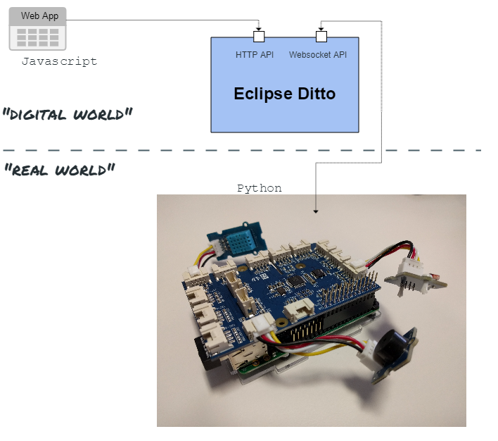

# Demo with a Raspberry Pi and a GrovePi+

This project enables you to use a Raspberry Pi with GrovePi+ as a Thing
that is managed by Eclipse Ditto and presents information in a WebUI.
The Thing will provide information about temperature, humidity and illumination.
Other way round the Thing can accept messages to enable or disable a Buzzer.
To be able to change the sampling rate, in which sensor values will be retrieved
and sent to Ditto, the Thing is listening to property change events.
Those property changes can be initiated by the WebUI and will have an effect on
how often the values are updated. Go on reading, if you want to know more
about the setup and how to get it running.



# Hardware Setup

* GrovePi+
* Raspberry Pi (tested with Model B+ v1.2)
* Grove Buzzer (tested with v1.1b)
* Grove Light Sensor (tested with v1.0)
* Grove Temperature and Humidity Sensor
* Machine for running Eclipse Ditto and the WebUI (we used a machine running Linux)


# Prerequisites

## Machine

* Up-to-date Web Browser
* a running Docker daemon (at least version 17.06 CE)
* Docker Compose installed (at least version 1.14)
* Apache Maven 3.x installed
* JDK 8 >= 1.8.0_92 (due to a bug in older versions of the JDK you'll get a compile error)


## Raspberry Pi

* Python 3.x installed
* GrovePi libraries installed (check the manufacturers page on
how to to this)
* Raspberry and machine running the same network

# Setup

# Setting up your machine

First, let's start by cloning this project onto the machine:

```bash
~ $ git clone <project-path>
~ $ cd ditto-examples/grove-ctrl
```

For all following shell commands, we assume you are inside
`ditto-examples/grove-control` folder on your machine.

To be able to move on, we need Eclipse Ditto installed and running
on the machine. Please follow the guidelines at the  [Eclipse Ditto](https://github.com/eclipse/ditto#getting-started)
project to start Eclipse Ditto.


When you have the Eclipse Ditto services up and running, we can
move on and create the Thing that we will use for playing around
with our Raspberry. The structure of the Thing can be found
inside [resources/thing-model.json](resources/thing-model.json).
To be able to use it, we will use the REST API of Eclipse Ditto
to create the Thing.

```bash
curl -u ditto:ditto -X PUT -d '@resources/thing-model.json' 'http://localhost:8080/api/1/things/org.eclipse.ditto.example:raspberry'
```

This command will create the Thing in our running Eclipse Ditto
instance. We used the default user/password `ditto:ditto` to create our Thing.
When having a look at the json file we can see another user in the
ACL (active control list) of the Thing: `raspberry`. This is the user
we will be using to connect to Eclipse Ditto from the Raspberry.
But first of all we need to create the user. Have a look at the [README](https://github.com/eclipse/ditto/tree/master/docker)
in the docker-folder of the _Ditto_ project. It describes how to create a new
password. We will use the password `raspberry` for our user `raspberry`. If
you want to use a different user/password, have a look at the [python/README.MD](python/README.md).

The user should automatically be available after changing the contents of the `nginx.httpasswd`
file. We can check it by using curl to retrieve the Thing with the raspberry user:

```bash
curl -u raspberry:raspberry -X GET 'http://localhost:8080/api/1/things/org.eclipse.ditto.example:raspberry'
```

This should return JSON equal to the [thing-model](resources/thing-model.json).
If it returns a 403 error, you should restart your Eclipse Ditto containers (`docker-compose restart`).

After creating our Thing, we can commence by opening the WebUI for the first time.
 @Todo: Philipp

What we should be left with:
* running Eclipse Ditto
* The Thing `org.eclipse.ditto.example:raspberry` available in Eclipse Ditto
* the user `raspberry` with password `raspberry`
* WebUI connected to Ditto


# Setting up the Raspberry Pi

Before plugging in your Raspberry Pi, connect the GrovePi+ to your
Raspberry Pi and connect the sensors as follows:

* Buzzer: Digital Port D8
* Light Sensor: Analog Port A0
* Temperature and Humidity Sensor: Digital Port D4

After that, we can boot the Raspberry Pi and continue by cloning the
project and moving into the `python` folder:

```bash
~ $ git clone <project-path>
~ $ cd ditto-examples/grove-ctrl/python
```

This folder contains several python files that are used to represent
the Raspberry as our Thing:

* _grove_temp_sensor.py, grove_buzzer.py, grove_light_sensor_: Abstractions
 for talking with the sensors and actuators that are connected to the GrovePi+.
* _raspberry_thing_: Handles when sensor values are polled and sent to
Eclipse Ditto, as well as updating sampling rates or enabling/disabling
the buzzer.
* _ditto_grove_demo.py_: Main script that will establish a Websocket connection
to Eclipse Ditto and handle sending and receiving Websocket messages.
* _grovepi_mock.py_: Simple mock for the GrovePi scripts if you want
to test the Thing without a GrovePi+. Have a look at [python/README.md](python/README.md)
to get to know how to do this.

Before we are able to start, we need to set the correct address and port of
the running Eclipse Ditto instance in `ditto_grove_demo.py`:

```python
DITTO_IP = "192.168.1.100"
DITTO_PORT = "8080"
```

Make sure the Raspberry Pi and your machine are part of the same network
and the port `DITTO_PORT` of your machine is available to other machines
on the same network. Then we can start the python script:

```bash
python3 ditto_grove_demo.py
```

The script may take some seconds and then print `### Websocket opened ###`.
If everything is working as expecte, you should see changes in the WebUI
on your machine. The sensor values should be updated once a second.

# Playing around with the WebUI

> The WebUI uses NPM for dependency management. Therefore you have to run `npm install` from the webapp root 
(`/webapp`) to fetch the WebUI dependencies before you start.

To monitor the sensor values and interact with the Raspberry Pi, view the WebUI in your Browser. Simply open 
`/webapp/index.html`. This works without running a webserver.

> Running the WebUI from a different domain than your Ditto instance might cause cross origin issues and prevent the 
site from loading data. You can workaround this by starting your browser without security (e.g. running Chrome with `--disabe-web-security`).

You should see the following view:


The top section shows all attributes of our thing rendered in a description list. This info is updated each page reload. Below are three cards, each modelling a feature of our Raspberry/Grove device. Feel free to

* view illuminance, temperature and humidity values and play with different sampling rates,
* or toggle the buzzer via messages.

The monitor values can retrieved via active polling or server side events (SSE) (configurable). Based on your setup, SSE might not be available as this standard does not provide an option to send auth headers.

You can configure the webapp over the right `Configure` button in the navbar. In the opened modal you can set your Ditto instance, auth, the displayed thing and the UIs update strategy. Apply your changes by choosing the `Save changes` action.


# Troubleshooting

## Timestamps are updated but sensor values stay the same

There seems to be a problem that causes the connection to the sensors
to not work properly. Doing a reboot helps.

## Why are the sensors slower than suggested by the sampling rate?

It may be that the sensors aren't able to respond as fast as the
sampling rate suggests them to. The python scripts running on the
Raspberry Pi will catch the faulty values and not send them to
Eclipse Ditto.


## Temperature sensor doesn't work at all
If the sensor is white, you need to change a parameter in the python script
found at [python/grove_temp_sensor.py](python/grove_temp_sensor.py):
```python
# 0 = blue sensor, 1 = white sensor
module_type = 1
```

If that doesn't help or apply to you, you should check if the Pi gets
enough power from the power supply. You can try to plug-off unused hardware.
Most times doing a simple reboot also helps.
