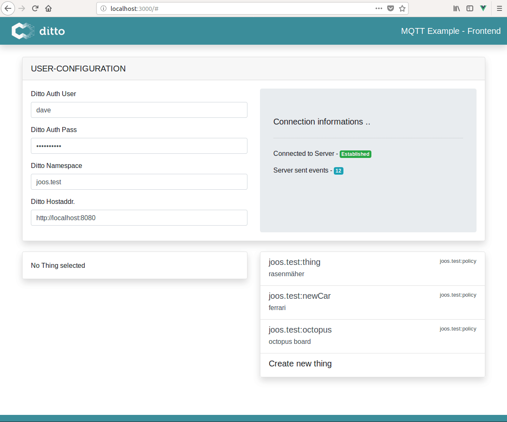

# MQTT-Bidirectional



In this Tutorial we will set up Ditto, connect an Arduino to it (via mqtt) and build a small front end app to show telemetry data exposed by the Arduino and to control the Arduino via Ditto Messages.

We will use an Octopus Board with an ESP8266 on it. It has several sensors built in, but for simplicity we will just use it's temperature and altitude sensor. To show the functionality of Ditto Messages we will control a LED on the Octopus Board.

The front-end will show all things contained under a specific namespace and let us modify a selected thing respectively send messages to it.

## Setting up ditto

### Prerequisites

1. eclipse-ditto

You can either use the [ditto sandbox](https://www.eclipse.org/ditto/sandbox.html), clone the latest version from [github](https://github.com/eclipse/ditto) or pull the latest docker images from the [docker hub](https://hub.docker.com/search/?isAutomated=0&isOfficial=0&page=1&pullCount=0&q=eclipse+ditto&starCount=0).

2. eclipse-mosquitto

Same here, either use the [mosquitto test server](https://test.mosquitto.org/), clone the latest version from [github](https://github.com/eclipse/mosquitto) or run it in a docker container locally on your machine via:
`docker run -d -p 1883:1883 -p 9001:9001 eclipse-mosquitto`

### Get started

#### Basics

Before we can start using the mqtt connectivity service, we have to set up a minimal project environment with at least one thing and a policy.

1. Policy

As stated in the [ditto HTTP API documentation](https://www.eclipse.org/ditto/http-api-doc.html) we can create a new policy easily via the HTTP API. The [policy](https://www.eclipse.org/ditto/basic-policy.html) determines who can access things in a given namespace.

*Hint: The namespace is a string, you can determine by yourself. It is in the Java package notation. Example: com.bosch or my.policy.beta etc*

For now we create a new policy via
```bash
curl -X post 'http://localhost:8080/api/2/policies/my.test:policy' -H 'Content-Type: application/json -d '{
  "entries": {
    "owner": {
      "subjects": {
        "nginx:ditto": {
          "type": "nginx basic auth user"
        }
      },
      "resources": {
        "thing:/": {
          "grant": [
            "READ","WRITE"
          ],
          "revoke": [

          ]
        },
        "policy:/": {
          "grant": [
            "READ","WRITE"
          ],
          "revoke": [
            
          ]
        },
        "message:/": {
          "grant": [
            "READ","WRITE"
          ],
          "revoke": [
            
          ]
        }
      }
    }
  }
}'

```
We have now created a policy for the user `ditto` which has `read` and `write` permissions to all things and messages under this policy and the policy itself.

2. Thing

With the created policy we can now go for our first thing. As stated above, we can herefore use the HTTP API:

```bash

curl -X put 'http://localhost:8080/api/2/things/my.test:octopus' -H 'Content-Type: application/json' -d '{
    "policyId": "my.test:policy",
    "attributes": {
        "name": "octopus",
        "type": "octopus board"
    },
    "features": {
        "temp_sensor": {
            "properties": {
                "value": 0
            }
        },
        "altitude": {
            "properties": {
                "value": 0
            }
        }
    }
}'

```
*Notice*: We passed the preassigned policy `my.test:policy` to the created thing. As stated above we have passed the temperature and altitude sensor to the features.

#### Create MQTT Connection

Before we can use mqtt we have to open a mqtt connection in ditto. We can do this by using the [DevOps commands](https://www.eclipse.org/ditto/installation-operating.html#devops-commands). In this case we need the *Piggyback Commands* to open a new connection.

To use these commands we have to send a `POST` Request to the URL `http://localhost:8080/devops/piggyback/connectivity?timeout=10000`.

The body of the request defines our command:

> *Important*: The authorized user for devops commnads is:
> 
> User: devops
> 
> Password: foobar

```json
{
    "targetActorSelection": "/system/sharding/connection",
    "headers": {},
    "piggybackCommand": {
        "type": "connectivity.commands:createConnection",
        "connection": {
			"id": "mqtt-example-connection-123",
			"connectionType": "mqtt",
			"connectionStatus": "open",
			"failoverEnabled": true,
			"uri": "test.mosquitto.org", // or your local mqtt broker
			"sources": [
				{
					"addresses": [
					"eclipse-ditto-sandbox/#"
					],
					"authorizationContext": ["nginx:ditto"],
					"qos": 0,
					"filters": []
				}
			],
			"targets": [
				{
				  "address": "eclipse-ditto-sandbox/{{ thing:id }}",
				  "topics": [
                    "_/_/things/twin/events",
                    "_/_/things/live/messages"
				  ],
				  "authorizationContext": ["nginx:ditto"],
				  "qos": 0
				}
			]
        }
    }
}

```

Ditto is now connected to the mosquitto broker and can receive and send mqtt messages.

### Payloadmapping

Depending on your IoT-Device we may have to map the payload we send to Ditto. Because IoT-Devices are often limited due to memory, it's useful not to send fully qualified Ditto Protocol Messages from the IoT-Device and instead send minimal JSON messages, which will be mapped from ditto later on.

In this case our octopus board will send messages like:
```json
{
    temp: 30.67,
    alt: 360.341
}
```
Ditto has to map the message above to a Ditto Protocol Message:
```json
{
    "thingId": "my.test:octopus",
    "policyId": "my.test:policy",
    "features": {
        "temp_sensor": {
            "properties": {
                "value": 30.67
            }
        },
        "altitude": {
            "properties": {
                "value": 360.341
            }
        }
    }
}
```
Therefore, we define following `incoming` mapping function:
```javascript
function mapToDittoProtocolMsg(headers, textPayload, bytePayload, contentType) {
    let jsonString = String.fromCharCode.apply(null, new Uint8Array(bytePayload));
    let jsonData = JSON.parse(jsonString); 
    let thingId = jsonData.thingId; 
    let value = { 
        temp_sensor: { 
            properties: { 
                value: jsonData.temp 
            } 
        },
        altitude: {            
            properties: {                
                value: jsonData.alt            
            }        
        }    
    };    
    return Ditto.buildDittoProtocolMsg(
        'my.test', // your namespace 
        thingId, 
        'things', // we deal with a thing
        'twin', // we want to update the twin
        'commands', // create a command to update the twin
        'modify', // modify the twin
        '/features', // modify all features at once
        headers, 
        value
    );
}
```
 To apply this mapping function, we just send this javascript function as a string to our connection:

```json
{
    "targetActorSelection": "/system/sharding/connection",
    "headers": {},
    "piggybackCommand": {
        "type": "connectivity.commands:modifyConnection",
        "connection": {
        	
			"id": "mqtt-example-connection-123",
			"connectionType": "mqtt",
			"connectionStatus": "open",
			"failoverEnabled": true,
			"uri": "tcp://test.mosquitto.org:1883",
			"sources": [
				{
					"addresses": [
					"ditto-tutorial/#"
					],
					"authorizationContext": ["nginx:ditto"],
					"qos": 0,
					"filters": []
				}
			],
			"targets": [
				{
				  "address": "ditto-tutorial/{{ thing:id }}",
				  "topics": [
				    "_/_/things/twin/events",
				    "_/_/things/live/messages"
				  ],
				  "authorizationContext": ["nginx:ditto"],
				  "qos": 0
				}
			],
			"mappingContext": {
				"mappingEngine": "JavaScript",
				"options": {
					"incomingScript": "function mapToDittoProtocolMsg(headers, textPayload, bytePayload, contentType) {let jsonString = String.fromCharCode.apply(null, new Uint8Array(bytePayload));let jsonData = JSON.parse(jsonString); let thingId = jsonData.thingId; let value = { temp_sensor: { properties: { value: jsonData.temp } },altitude:        {            properties:            {                value: jsonData.alt            }        }    };    return Ditto.buildDittoProtocolMsg('my.test', thingId, 'things', 'twin', 'commands', 'modify', '/features', headers, value);}"
				}
			}
        }
    }
}
```

*Notice:* You can apply the payloadmapping at the creation of the policy as well.

> Now Ditto is set up and you can connect your IoT Device to it.

## Connecting an Arduino Device to Eclipse-Ditto

### Requirements

1. An Arduino or an other developer board like "Funduino" etc. This tutorial will work with an Octopus Board (which is pretty rare but most of the code will work with every other board with an ESP8266 on it).
2. You can eiter use the [Arduino IDE](https://www.arduino.cc/en/Main/Software) or [PlatformIO](https://platformio.org/) (highly recommended) which offers a command-line client - if you're a Visual Studio Code User, check out the PlatformIO IDE Extension. PlatformIO let you use your favourite text editor which is pretty neat instead of using the rigid Arduino IDE.

### Preparing your IDE

#### Arduino IDE
1. Add the ESP8266 Platform to the IDE, see [here](https://github.com/esp8266/Arduino).
2. Install the following libraries (Sketch -> Include Library -> Manage Libraries)
    1. [Adafruit Unified Sensor Library](https://github.com/adafruit/Adafruit_Sensor)
    2. [Adafruit BME680 library](https://github.com/adafruit/Adafruit_BME680)
    3. [Adafruit BME280 library](https://github.com/adafruit/Adafruit_BME280)
    4. [Adafruit BNO055 library](https://github.com/adafruit/Adafruit_BNO055)
    5. [Adafruit NeoPixel library](https://github.com/adafruit/Adafruit_NeoPixel)
    6. [PubSubClient library](https://github.com/knolleary/pubsubclient)
    7. [ArduinoJson](https://github.com/bblanchon/ArduinoJson)
3. Edit the file `${ArduinoDirectory}/libraries/pubsubclient/src/PubSubClient.h` and set the MQTT_MAX_PACKET_SIZE to 2048.

#### PlatformIO

##### Prerequesites
1. Python
2. pip
3. virtualenv

##### Installation

To install the platformIOCli follow the installation instructions [here](https://docs.platformio.org/en/latest/installation.html) or install the Atom|VS Code Extension.
*Hint:* VS Code is unable to install an extension behind a corporate proxy.

If you have set up a new project, install the depencies (see above) via `pio lib install <Library>` - in case that any library won't be found, it's possible to search for it manually like:
`pio lib search -i 'Adafruit_BNO055.h` (for example). If *pio lib* has found the library you can install it by it's id.

When you're set and all of the needed dependencies are installed - we have to set the `MQTT_MAX_PACKET_SIZE` in `~/yourProjectPath/.piolibdeps/PubSubClient_ID89/src/PubSubClient.h` to (a minimum of) `1024`.

*Hint:* Go for some of the examples in [here](https://github.com/esp8266/Arduino) and check if they compile (with `pio run`).

### Getting started

With PlatformIO:
```bash
$ cd iot-device/octopus
$ pio run --target upload
// Serial Monitor:
$ pio device monitor -b 115200
```

### Using MQTT to send/receive Messages on your IoT-Device

The file `iot-device/octopus/src/main.cpp` contains the whole Arduino Code.

#### Receive

There are many options to receive Messages on your Device. We could apply a payload mapping function for outgoing messages from ditto (as well as incoming mapping - see [here](#Payloadmapping)) but in this tutorial we receive the full Ditto Protocol Message for the simplicity.

For now we just accept the fact, that our device get's messages under the main topic (defined in the connection - see [here](#Create_MQTT_Connection)), in this tutorial: `ditto-tutorial/` and it's thingId `my.test:octopus/` plus a "command" topic (in this example:) `LED`

> It's not part of this tutorial to show how to establish a wireless or mqtt connection. For further questions see the code in `main.cpp` and it's comments.

In the message received callback `messageReceived` we can now handle the incoming message:
```c++
void messageReceived(char* topic, byte* payload, unsigned int length) {

    JsonObject& root = jsonBuffer.parseObject(payload);

    if (root.size() > 0 && root.containsKey("path") && root.containsKey("value")){
        // Get feature to handle and it's value
        const char* path = root["path"];
        const char* value = root["value"];

        char* substring = subStr(path, "/", 3);

        if (strcmp(substring, "LED") == 0){
            setLED(value);
        }
    } else if(!root.containsKey("temp")) {
        Serial.println("[error] - Invalid JSON Object.");
    }
    jsonBuffer.clear();
}
```
Due to the fact, that we just control the build in LED, this callback has nothing to do except parsing the incoming message for it's command (`substring`) and it's payload (`value`). The function above parses the full MQTT Topic `ditto-tutorial/my.test:octopus/LED` for it's last substring, check's if it's `LED` and if yes, set the LED to the payload of the MQTT Message ("on" | "off"):

```c++
void setLED(const char* powerState){
    if (strcmp(powerState, "on") == 0){
        // Set LED to red
        strip.setPixelColor(0, 255, 0, 0);
    } else {
        // Set LED to no light -> #off
        strip.setPixelColor(0, 0, 0, 0);
    }
    strip.show();
}
```

#### Send

We want to send the sensor data of our device as telemetry data to ditto, which updates the digital twin and is therefore always accessable for our front-end.
Because we have applied a payload mapping function before, we can just send our data simple as:
```json
{
    temp: 30.67,
    alt: 360.341
}
```
This means, we send our sensor data periodically to the MQTT Topic `/ditto-tutorial/my.test:octopus` with a function like
```c++
void readSensors(){
    // Readable sensors -> reduced on temp and altitude
    JsonObject& root = jsonBuffer.createObject();
    root["temp"] = bme680.readTemperature();
    root["alt"] = bme680.readAltitude(SEALEVELPRESSURE_HPA);
    root["thingId"] = thingId;

    // Transform JSON Object to const char*
    char jsonChar[100];
    root.printTo((char*)jsonChar, root.measureLength() + 1);

    client.publish(outTopic, jsonChar); // outTopic = /ditto-tutorial/my.test:octopus

    // Clear JSON buffer for further use
    jsonBuffer.clear();
}
```

## Front-end

### Getting started

Installation:
```bash
$ cd iot-solution

// yarn
$ yarn install

// npm
$ npm -i
```

Running Dev-Server (with hot reloading):
```bash
// yarn
$ yarn serve

// npm
$ npm run serve
```

### Sending a command message

We will use the promise based HTTP client [axios](https://github.com/axios/axios) for the requests.

The following code describes how to send a command message via ditto to your device. The message will forwarded by ditto to the device, where the subject will be the topic of the mqtt message:
```js
axios
.post(`${hostaddress}/api/2/things/${thingId}/inbox/messages/${subject}`, payload, {
    headers: {
        Authorization: 'Basic <Base64 Auth Hash>',
        'content-type': 'application/json'
    }
})
.then( res => {
    // Handle response
})
.catch( err => {
    // Handle error
})
```

### Subscribe to Server sent events

If we are using our front-end solution and do operative work, it could be necessary to get updates if the twin which we are modifying right now, has been updated. To solve this problem we can subscribe for server sent events:
```javascript
let source = new EventSource(`${hostaddress}/api/2/things?=${thingId}`)
source.onmessage = event => {
    console.log(event) // or do something with it
}
```

> For the HTTP API see [here](http://www.eclipse.org/ditto/http-api-doc.html)
> 
> See a full sample project unter `/iot-frontend`


