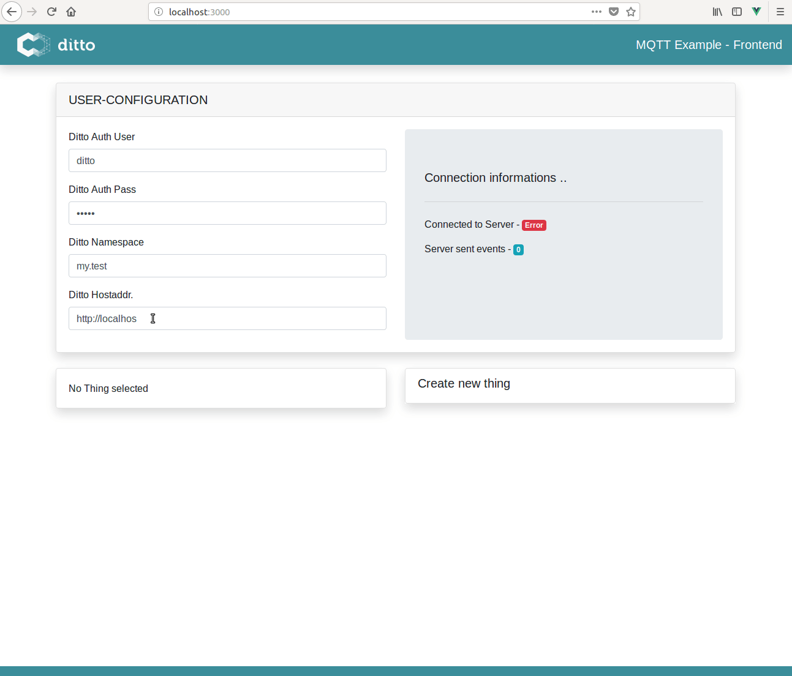
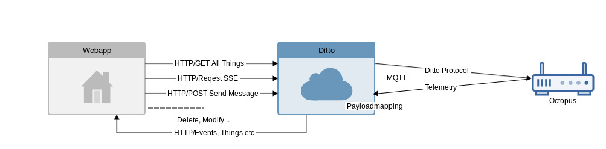

# MQTT-Bidirectional



## Summary

This example is about how to communicate between device and solution in a two way pattern through Ditto using MQTT.
This means we will add a policy, a thing and a MQTT connection to Ditto. When Ditto ist set up and working, we will create real world
device ("octopus board") and connect it to it's digital twin via MQTT. At the end, we will create a basic frontend webapp.
The webapp will automatically connect to Ditto when you type in your credentials, automatically pull your things
and show them in a list. You can create, modify and delete devices in the webapp and if there is a real world device
connected to the thing in the list, you can send it a command message to control any feature on it. The list of things
will always be up-to-date when you listen to server-sent-events, which you can activate easily with pressing a button.



We will use an Octopus-board with an ESP8266 on it. It has several sensors built in, but for simplicity
we will just use it's temperature and altitude sensor. To show the functionality of Eclipse Ditto messages,
we will switch on/off a LED on the Octopus-board through it.

## Setting up Ditto

### Prerequisites

1. Eclipse Ditto

You can either use the [ditto sandbox](https://www.eclipse.dev/ditto/sandbox.html), clone the latest version
from [github](https://github.com/eclipse/ditto) or pull the latest Docker images from the
[docker hub](https://hub.docker.com/search/?isAutomated=0&isOfficial=0&page=1&pullCount=0&q=eclipse+ditto&starCount=0).

2. Eclipse Mosquitto

Same here, either use the [mosquitto test server](https://test.mosquitto.org/), clone the latest version
from [github](https://github.com/eclipse/mosquitto) or run it in a Docker container locally on your machine via:
`docker run -d -p 1883:1883 -p 9001:9001 eclipse-mosquitto`

### Get started

**Important Note**
> If you don't want to use the user "ditto" for authorization, you have to add a new user to `/pathToDitto/ditto/deployment/docker/ngingx.htpasswd` - how to do this, see: `/pathToDitto/ditto/deployment/docker/README.md`. If you have added a new user, please note that you have to replace your user with the user "ditto" in all code of this tutorial.

For this example, we will use the latest Ditto version from github. After cloning the repository,
we can start the Docker containers like so:
```bash
$ cd /<yourCustomDir>/ditto/deployment/docker
$ docker-compose up -d
```

> When using the sandbox environment, please adjust the URLs for the upcoming REST calls.

We will use Eclipse Mosquittos test server for demonstrating the MQTT connection. If you want to use
another broker, please adjust the URLs / IPs in all REST calls and sources of this example.

#### Basics

Before we start using the MQTT connectivity service, we will set up a minimal project environment
with at least one thing and a policy.

1. Policy

As stated in the [Eclipse Ditto HTTP API documentation](https://www.eclipse.dev/ditto/http-api-doc.html)
we can create a new policy easily via the HTTP API. The [policy](https://www.eclipse.dev/ditto/basic-policy.html)
determines who is allowed to access things in a given namespace.

*Hint: The namespace is a string that you can choose yourself, but it has to be in the Java Package Notation -
Example: org.eclipse or my.policy.beta etc.*

For now we create a new policy via
```bash
curl -X PUT 'http://localhost:8080/api/2/policies/my.test:policy' -u 'ditto:ditto' -H 'Content-Type: application/json' -d '{
    "entries": {
        "owner": {
            "subjects": {
                "nginx:ditto": {
                    "type": "nginx basic auth user"
                }
            },
            "resources": {
                "thing:/": {
                    "grant": [
                        "READ","WRITE"
                    ],
                    "revoke": []
                },
                "policy:/": {
                    "grant": [
                        "READ","WRITE"
                    ],
                    "revoke": []
                },
                "message:/": {
                    "grant": [
                        "READ","WRITE"
                    ],
                    "revoke": []
                }
            }
        }
    }
}'

```
We have now created a policy for the user `ditto` that has `read` and `write` permissions to all things
and messages under this policy and the policy itself.

1. Thing

With the created policy we can now go for our first thing. As stated above, we can use the HTTP API for this:

```bash

curl -X PUT 'http://localhost:8080/api/2/things/my.test:octopus' -u 'ditto:ditto' -H 'Content-Type: application/json' -d '{
    "policyId": "my.test:policy",
    "attributes": {
        "name": "octopus",
        "type": "octopus board"
    },
    "features": {
        "temp_sensor": {
            "properties": {
                "value": 0
            }
        },
        "altitude": {
            "properties": {
                "value": 0
            }
        }
    }
}'

```
*Notice*: We passed the preassigned policy `my.test:policy` to the created thing. As stated above we added
the temperature and altitude sensor to the features.

#### Create a MQTT Connection

Before we can use MQTT, we have to open a MQTT connection in Eclipse Ditto. We can do this
by using [DevOps Commands](https://www.eclipse.dev/ditto/installation-operating.html#devops-commands).
In this case we need the *Piggyback Commands* to open a new connection.

To use these commands we have to send a `POST` Request to the URL `http://localhost:8080/devops/piggyback/connectivity?timeout=10000`.

> *Important(!)* 
> 
> The authorized user for devops commands differs from the default Ditto user:
> 
> User: devops \
> Password: foobar


The body of the request defines our command:

```json
{
    "targetActorSelection": "/system/sharding/connection",
    "headers": {
    	"aggregate": false
    },
    "piggybackCommand": {
        "type": "connectivity.commands:createConnection",
        "connection": {
            "id": "mqtt-example-connection-123",
            "connectionType": "mqtt",
            "connectionStatus": "open",
            "failoverEnabled": true,
            "uri": "tcp://test.mosquitto.org:1883",
            "sources": [{
                "addresses": ["ditto-tutorial/#"],
                "authorizationContext": ["nginx:ditto"],
                "qos": 0,
                "filters": []
            }],
            "targets": [{
                "address": "ditto-tutorial/{{ thing:id }}",
                "topics": [
                "_/_/things/twin/events",
                "_/_/things/live/messages"
                ],
                "authorizationContext": ["nginx:ditto"],
                "qos": 0
            }]
        }
    }
}
```

Ditto is now connected to the mosquitto broker and can receive and send MQTT messages.

### Payload mapping

Depending on your IoT-Device, you may have to map the payload that you send to Eclipse Ditto.
Because IoT-Devices are often limited due to their memory, it's reasonable not to send fully qualified
Ditto-Protocol messages from the IoT-Device. We will send minimal JSON messages instead, which will be
mapped to Ditto-Protocol messages when received.

In this case our Octopus-board will send messages like (we remember -> just the temperature and altitude sensor):
```json
{
    "temp": 30.67,
    "alt": 360.341,
    "thingId": "my.test:octopus"
}
```
Ditto has to map the message above to a Ditto Protocol Message:
```json
{
    "thingId": "my.test:octopus",
    "policyId": "my.test:policy",
    "features": {
        "temp_sensor": {
            "properties": {
                "value": 30.67
            }
        },
        "altitude": {
            "properties": {
                "value": 360.341
            }
        }
    }
}
```
Therefore, we define the following `incoming` mapping function:
```JavaScript
function mapToDittoProtocolMsg(headers, textPayload, bytePayload, contentType) {
    const jsonString = String.fromCharCode.apply(null, new Uint8Array(bytePayload));
    const jsonData = JSON.parse(jsonString); 
    const thingId = jsonData.thingId.split(':'); 
    const value = { 
        temp_sensor: { 
            properties: { 
                value: jsonData.temp 
            } 
        },
        altitude: {            
            properties: {                
                value: jsonData.alt            
            }        
        }    
    };    
    return Ditto.buildDittoProtocolMsg(
        thingId[0], // your namespace 
        thingId[1], 
        'things', // we deal with a thing
        'twin', // we want to update the twin
        'commands', // create a command to update the twin
        'modify', // modify the twin
        '/features', // modify all features at once
        headers, 
        value
    );
}
```
 To apply this mapping function on incoming messages, we add the above javascript function
 (as a string) to our connection using another Piggyback DevOps command:

```json
{
    "targetActorSelection": "/system/sharding/connection",
    "headers": {
    	"aggregate": false
    },
    "piggybackCommand": {
        "type": "connectivity.commands:modifyConnection",
        "connection": {
            "id": "mqtt-example-connection-123",
            "connectionType": "mqtt",
            "connectionStatus": "open",
            "failoverEnabled": true,
            "uri": "tcp://test.mosquitto.org:1883",
            "sources": [{
                "addresses": ["ditto-tutorial/#"],
                "authorizationContext": ["nginx:ditto"],
                "qos": 0,
                "filters": []
            }],
            "targets": [{
                "address": "ditto-tutorial/{{ thing:id }}",
                "topics": [
                "_/_/things/twin/events",
                "_/_/things/live/messages"
                ],
                "authorizationContext": ["nginx:ditto"],
                "qos": 0
            }],
            "mappingContext": {
                "mappingEngine": "JavaScript",
                "options": {
                    "incomingScript": "function mapToDittoProtocolMsg(headers, textPayload, bytePayload, contentType) {const jsonString = String.fromCharCode.apply(null, new Uint8Array(bytePayload));const jsonData = JSON.parse(jsonString); const thingId = jsonData.thingId.split(':'); const value = { temp_sensor: { properties: { value: jsonData.temp } },altitude:        {            properties:            {                value: jsonData.alt            }        }    };    return Ditto.buildDittoProtocolMsg(thingId[0], thingId[1], 'things', 'twin', 'commands', 'modify', '/features', headers, value);}"
                }
            }
        }
    }
}
```

*Notice:* You can apply the payload mapping at the creation of the connection as well.

> Now Ditto is set up and you can connect your IoT Device to it.

## Connecting an Arduino Device to Eclipse Ditto

### Requirements

1. An Arduino or another developer board like "Funduino" etc. This example will work with an
Octopus-board (which is pretty rare but most of the code will work with every other board with an ESP8266 on it).
2. You can either use the [Arduino IDE](https://www.arduino.cc/en/Main/Software) or
[PlatformIO](https://platformio.org/) (highly recommended) which offers a command-line client -
if you're a Visual Studio Code user, check out the PlatformIO IDE Extension. PlatformIO lets
you use your favourite text editor, which is pretty neat instead of using the rigid Arduino IDE.

### Preparing your IDE

#### Arduino IDE
1. Add the ESP8266 Platform to the IDE, see [ESP8266 Arduino Platfrom](https://github.com/esp8266/Arduino).
2. Install the following libraries (Sketch -> Include Library -> Manage Libraries)
    1. [Adafruit Unified Sensor Library](https://github.com/adafruit/Adafruit_Sensor)
    2. [Adafruit BME680 library](https://github.com/adafruit/Adafruit_BME680)
    3. [Adafruit BME280 library](https://github.com/adafruit/Adafruit_BME280)
    4. [Adafruit BNO055 library](https://github.com/adafruit/Adafruit_BNO055)
    5. [Adafruit NeoPixel library](https://github.com/adafruit/Adafruit_NeoPixel)
    6. [PubSubClient library](https://github.com/knolleary/pubsubclient)
    7. [ArduinoJson](https://github.com/bblanchon/ArduinoJson)
    7. [ESP8266Ping](https://github.com/dancol90/ESP8266Ping)
3. Edit the file `${ArduinoDirectory}/libraries/pubsubclient/src/PubSubClient.h` and set the
`MQTT_MAX_PACKET_SIZE` to `2048`.

#### PlatformIO

##### Prerequisites
1. Python
2. pip
3. virtualenv

##### Installation

To install the platformIOCli follow the [installation instructions](https://docs.platformio.org/en/latest/installation.html)
or install the Atom|VS Code Extension. *Hint:* VS Code is unable to install extensions behind a corporate proxy.

If you have set up a new project, install the dependencies (see above respectively [Arduino IDE](#Arduino_IDE))
via `pio lib install <Library>` - in case that a library can't be found, it's possible to install it 
from the github repository (see the platformIO manual).

When you're set and all of the needed dependencies are installed - we have to set the
`MQTT_MAX_PACKET_SIZE` in `~/yourProjectPath/.piolibdeps/PubSubClient_ID89/src/PubSubClient.h` to `2048`.

*Hint:* To check if your setup is working as expected, you can go for some of the examples in the
[Arduino ESP8266 git repository](https://github.com/esp8266/Arduino) and check if they compile (with `pio run`).

### Getting started

The Octopus board needs to be connected to the internet to be able to send messages to `test.mosquitto.org`.
Therefore we set valid Wifi credentials in lines `16-17` in `iot-device/octopus/src/main.ino`.

In this demo, we use PlatformIO for compiling and uploading the code to our Octopus board:
```bash
$ cd iot-device/octopus
$ pio run --target upload
// Serial Monitor:
$ pio device monitor -b 115200
```

> You can check the logs using the serial monitor to verify that your board is able to establish
a Wifi connection and can access `test.mosquitto.org`.

### Using MQTT to send/receive Messages on your IoT-Device

The file `iot-device/octopus/src/main.ino` contains the Arduino Code.

#### Receive

There are many options to receive messages on your device. We could apply a payload mapping function
for outgoing messages from Eclipse Ditto (as well as incoming mapping - see [Payloadmapping](#Payloadmapping))
but in this example we will receive the full Ditto-Protocol message for the sake of simplicity.

For now we just accept the fact, that our device gets messages in the main topic (defined in the
connection - see [Create MQTT Connection](#Create_MQTT_Connection)): `ditto-tutorial/` and it's
thingId `my.test:octopus/` plus a "command" topic (in this example:) `LED`

> It's not part of this example to show how to establish a wireless or a MQTT connection. For
further questions, see the code in `main.ino` and it's comments.

In the `messageReceived` callback, we can now handle the incoming message:
```cpp
void messageReceived(char* topic, byte* payload, unsigned int length) {

    JsonObject& root = jsonBuffer.parseObject(payload);

    if (root.size() > 0 && root.containsKey("path") && root.containsKey("value")){
        // Get feature to handle and it's value
        const char* path = root["path"];
        const char* payload = root["value"];

        char* command = subStr(path, "/", 3);

        if (strcmp(command, "LED") == 0){
            setLED(payload);
        }
    } else if(!root.containsKey("temp")) {
        Serial.println("[error] - Invalid JSON Object.");
    }
    jsonBuffer.clear();
}
```
Due to the fact, that we just control the built-in LED, this callback has nothing to do except
parsing the incoming message for it's `command` and it's `payload`. The function above parses the full
MQTT topic `ditto-tutorial/my.test:octopus/LED` for it's last substring, check's if it's `LED` and if
yes, set the LED to the payload of the MQTT Message (`"on"` | `"off"`):

```cpp
void setLED(const char* powerState){
    if (strcmp(powerState, "on") == 0){
        // Set LED to red
        strip.setPixelColor(0, 255, 0, 0);
    } else {
        // Set LED to no light -> #off
        strip.setPixelColor(0, 0, 0, 0);
    }
    strip.show();
}
```

#### Send

We want to send the sensor data of our device as telemetry data to ditto, which updates the digital
twin and is therefore always accessible for our front-end. Because we have applied a payload mappin 
function before, we can just send our data simple as:
```json
{
    "temp": 30.67,
    "alt": 360.341,
    "thingId": "my.test:octopus"
}
```
This means, we send our sensor data periodically to the MQTT Topic `/ditto-tutorial/my.test:octopus`
with a function like
```cpp
void readSensors(){
    // Readable sensors -> reduced on temp and altitude
    JsonObject& root = jsonBuffer.createObject();
    root["temp"] = bme680.readTemperature();
    root["alt"] = bme680.readAltitude(SEALEVELPRESSURE_HPA);
    root["thingId"] = thingId;

    // Transform JSON Object to const char*
    char jsonChar[100];
    root.printTo((char*)jsonChar, root.measureLength() + 1);

    client.publish(outTopic, jsonChar); // outTopic = /ditto-tutorial/my.test:octopus

    // Clear JSON buffer for further use
    jsonBuffer.clear();
}
```

## Front-end

The example in `/iot-frontend` uses following frameworks:
* [Vue.js](https://vuejs.org)
* [Bootstrap](http://getbootstrap.com/)
* [axios](https://github.com/axios/axios)
* [Vuex](https://vuex.vuejs.org/)
* [Codemirror](https://codemirror.net/)

### Getting started

Installation:
```bash
$ cd iot-solution

// install dependencies using yarn
$ yarn install

// or install dependencies using npm
$ npm -i
```

Running Dev-Server (with hot reloading):
```bash
// serving the ui using yarn
$ yarn serve

// or serving the ui using npm
$ npm run serve
```

### Sending a command message

We will use the promise based HTTP client [axios](https://github.com/axios/axios) for the requests.

The following code describes how to send a command message via Ditto to your device. Eclipse Ditto
will forward the message to your device. The subject of the message will be the topic of the resulting 
MQTT message:
```JavaScript
axios
.post(`${hostaddress}/api/2/things/${thingId}/inbox/messages/${subject}`, payload, {
    headers: {
        Authorization: 'Basic <Base64 Auth Hash>',
        'content-type': 'application/json'
    }
})
.then( res => {
    // Handle response
})
.catch( err => {
    // Handle error
})
```

### Subscribe to Server Sent Events

If we are using our front-end solution and do operative work, it could be necessary to get updates if
the twin which we are modifying right now, has been updated. To solve this problem we can subscribe for
server sent events:
```JavaScript
let source = new EventSource(`${hostaddress}/api/2/things?=${thingId}`)
source.onmessage = event => {
    console.log(event) // or do something with it
}
```

> For further information, have a look at the [HTTP API documentation](http://www.eclipse.dev/ditto/http-api-doc.html)

## Conclusion

When everything is set up properly you should have access to the MQTT Example Frontend through `http://localhost:3000` . You should see your added things after typing in your credentials and the automatically established connection. Request server-sent-events through clicking the button in the connections field. Once you are registered to the SSE's the things in your frontend are always up-to-date, because every SSE triggers a reload of the thing with the actual data. To switch off and on the LED on the Octopus board, chose the octopus thing in your list and send it a message with topic `LED` and payload `on` or `off`. If nothing happens, check the serial monitor of your device and check that the mqtt connection has been established correctly.

From this point on you are fully set up and free to extend the code and build your first IoT infrastructure! 

Happy Coding!

