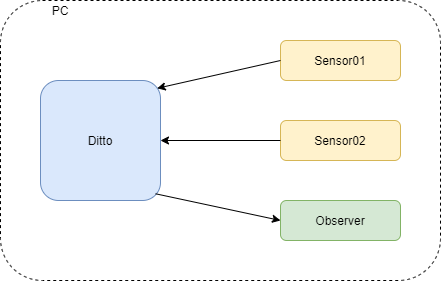

## Summary

This example presents how to configure Ditto to be able update things and receive notification about changes via MQTT.
In this example we will create two things in Ditto, they will be updated via MQTT, we will also receives changes in those things via MQTT.



## Prerequisites

1. Eclipse Ditto  
You can either use the [ditto sandbox](https://www.eclipse.org/ditto/sandbox.html), clone the latest version
from [github](https://github.com/eclipse/ditto) or pull the latest Docker images from the
[docker hub](https://hub.docker.com/search/?isAutomated=0&isOfficial=0&page=1&pullCount=0&q=eclipse+ditto&starCount=0).

2. Eclipse Mosquitto  
Same here, either use the [mosquitto test server](https://test.mosquitto.org/), clone the latest version
from [github](https://github.com/eclipse/mosquitto) or run it in a Docker container locally on your machine via:
`docker run -d -p 1883:1883 -p 9001:9001 -v /PATH_TO/mosquitto.conf:/mosquitto/config/mosquitto.conf eclipse-mosquitto`  
Ths mosquitto.conf has the following content:  
```
listener 1883
listener 9001
protocol websockets
allow_anonymous true
```

You can also run Mosquitto broker directly on your host machine.

## Create policy

We need to create to policies:
- for source connection to be able to modify things
- for target connection to be able to observe things' modifications

Create policy.json file with the following content:
```
{
    "policyId": "my.test:policy",
    "entries": {
        "owner": {
            "subjects": {
                "nginx:ditto": {
                    "type": "nginx basic auth user"
                }
            },
            "resources": {
                "thing:/": {
                    "grant": ["READ","WRITE"],
                    "revoke": []
                },
                "policy:/": {
                    "grant": ["READ","WRITE"],
                    "revoke": []
                },
                "message:/": {
                    "grant": ["READ","WRITE"],
                    "revoke": []
                }
            }
        },

        "observer": {
            "subjects": {
                "ditto:observer": {
                    "type": "observer user"
                }
            },
            "resources": {
                "thing:/features": {
                    "grant": ["READ"],
                    "revoke": []
                },
                "policy:/": {
                    "grant": ["READ"],
                    "revoke": []
                },
                "message:/": {
                    "grant": ["READ"],
                    "revoke": []
                }
            }
        }
    }
}
```

Create policy in Ditto by running:
`curl -X PUT 'http://localhost/api/2/policies/my.test:policy' -u 'ditto:ditto' -H 'Content-Type: application/json' -d @policy.json`

## Create things

To keep this example as simple as possible we will create two temperature and humidity sensors as our things. Create two files- sensor01.json and sensor02.json.
As sensorp01.json content use:
```
{
    "policyId": "my.test:policy",
    "attributes": {
        "manufacturer": "Well known sensors producer",
        "serial number": "100",
        "location": "Ground floor"
    },
    "features": {
        "measurements": {
            "properties": {
                "temperature": 0,
                "humidity": 0
            }
        }
    }
}
```

And sensor02.json:
```
{
    "policyId": "my.test:policy",
    "attributes": {
        "manufacturer": "Well known sensors producer",
        "serial number": "200",
        "location": "First floor"
    },
    "features": {
        "measurements": {
            "properties": {
                "temperature": 0,
                "humidity": 0
            }
        }
    }
}
```

And crete these two things in Ditto:
`curl -X PUT 'http://localhost/api/2/things/my.sensors:sensor01' -u 'ditto:ditto' -H 'Content-Type: application/json' -d @sensor01.json`

`curl -X PUT 'http://localhost/api/2/things/my.sensors:sensor02' -u 'ditto:ditto' -H 'Content-Type: application/json' -d @sensor02.json`

## Payload mappings

Ditto uses Ditto Protocol for cummunication. It is a JSON based text protocol but it is not human friendly. Instead of using plain Ditto Protocol you can use simpler JSON messages and map them to form accepted by Ditto Protocol.
We will use a JavaScript to map message to and from Ditto Protocol. First let's see how to map simple message to Ditto Protocol.
Our sensors measures only two values- temperature and humidity therefore we just want to send only those data. Our example format could be as follows:
`{'temperature": 10, "humidity": 50, "thingId": "my.sensors:sensor01"}`

We have dictionary with three values- temperature, humidity and thingId which will be need by Ditto to set values of proper thing. To map such JSON dictionry to Ditto Protocol form we need to implement the following JS function:

```
function mapToDittoProtocolMsg(headers, textPayload, bytePayload, contentType) {
    // Get sent data
    const jsonString = String.fromCharCode.apply(null, new Uint8Array(bytePayload));
    // Parse received data
    const jsonData = JSON.parse(jsonString);
    // Get thing's namespace and ID
    const thingId = jsonData.thingId.split(':');
    // Prepare features to be set
    const value = {
            measurements: {
                properties: {
                    temperature: jsonData.temperature,
                    humidity: jsonData.humidity
                }
            }
        };
    // Return Ditto Protocol message
	return Ditto.buildDittoProtocolMsg(
        thingId[0], // your namespace
        thingId[1],
        'things', // we deal with a thing
        'twin', // we want to update the twin
        'commands', // create a command to update the twin
        'modify', // modify the twin
        '/features', // modify all features at once
        headers,
        value
    );
}
```
We need also function that will do a reverse process it means mapping data from Ditto Protocol form to more human friendly form:

```
function mapFromDittoProtocolMsg(namespace, id, group, channel, criterion, action, path, dittoHeaders, value, status, extra) {
    // Create text data
    let textPayload = '{"temperature": ' + value.measurements.properties.temperature + ', "humidity": ' + value.measurements.properties.humidity + ', "thingId": "' + namespace + ':' + id + '"}';
    // In this case we data only in text format
    let bytePayload = null;
    // Set message content type
    let contentType = 'text/plain; charset=UTF-8';

    // Return mapped message
    return  Ditto.buildExternalMsg(
        dittoHeaders,
        textPayload,
        bytePayload,
        contentType
    );
}
```

These functions will be used in connections configurations.

## Connections

To be able to update things in Ditto and receive notifications from it we need to configure connections. Here we will need to connections:
- source connection for updating thing's state
- target connection for sending notifications about thing's state modifications

Let's start with soruce connection:
```
{
    "targetActorSelection": "/system/sharding/connection",
    "headers": {
    	"aggregate": false
    },
    "piggybackCommand": {
        "type": "connectivity.commands:createConnection",
        "connection": {
            "id": "mqtt-connection-source",
            "connectionType": "mqtt",
            "connectionStatus": "open",
            "failoverEnabled": true,
            "uri": "tcp://HOST_IP:1883",
            "sources": [{
                "addresses": ["my.sensors/#"],
                "authorizationContext": ["nginx:ditto"],
                "qos": 0,
                "filters": []
            }],
            "mappingContext": {
                "mappingEngine": "JavaScript",
                "options": {
                    "incomingScript": "function mapToDittoProtocolMsg(headers, textPayload, bytePayload, contentType) {const jsonString = String.fromCharCode.apply(null, new Uint8Array(bytePayload)); const jsonData = JSON.parse(jsonString); const thingId = jsonData.thingId.split(':'); const value = {measurements: {properties: {temperature: jsonData.temperature, humidity: jsonData.humidity}}}; return Ditto.buildDittoProtocolMsg(thingId[0], thingId[1], 'things', 'twin', 'commands', 'modify', '/features', headers, value);}",
                    "outgoingScript": "function mapFromDittoProtocolMsg(namespace, id, group, channel, criterion, action, path, dittoHeaders, value, status, extra) {return null;}",
                    "loadBytebufferJS": "false",
                    "loadLongJS": "false"
                }
            }
        }
    }
}
```

You can save it in connection_source.json file.

Look at incomingScript property, this is mapToDittoProtocolMsg function we've implemented earlier. It needs to be in one line form to be accepted by connection configuration. In case of source connection outgoingScript does nothing therefore it just returns a null.

Now we need to configure target connection. Create connectio_target.json file with content:

```
{
    "targetActorSelection": "/system/sharding/connection",
    "headers": {
    	"aggregate": false
    },
    "piggybackCommand": {
        "type": "connectivity.commands:createConnection",
        "connection": {
            "id": "mqtt-connection-target",
            "connectionType": "mqtt",
            "connectionStatus": "open",
            "failoverEnabled": true,
            "uri": "tcp://HOST_IP:1883",
            "targets": [{
                "address": "my.sensors.notifications/{{ thing:id }}",
                "topics": [
                    "_/_/things/twin/events",
                    "_/_/things/live/messages"
                ],
                "authorizationContext": ["ditto:observer"],
                "qos": 0
            }],
            "mappingContext": {
                "mappingEngine": "JavaScript",
                "options": {
                    "incomingScript": "function mapToDittoProtocolMsg(headers, textPayload, bytePayload, contentType) {return null;}",
                    "outgoingScript": "function mapFromDittoProtocolMsg(namespace, id, group, channel, criterion, action, path, dittoHeaders, value, status, extra) {let textPayload = '{\"temperature\": ' + value.measurements.properties.temperature + ', \"humidity\": ' + value.measurements.properties.humidity + ', \"thingId\": \"' + namespace + ':' + id + '\"}'; let bytePayload = null; let contentType = 'text/plain; charset=UTF-8'; return  Ditto.buildExternalMsg(dittoHeaders, textPayload, bytePayload, contentType);}",
                    "loadBytebufferJS": "false",
                     "loadLongJS": "false"
                }
            }
        }
    }
}
```
In that case outgoingScript property is set to mapFromDittoProtocolMsg that we've implemented earlier. incomingScript is not needed now therefore it just return a null.
Remember to set your host's IP address in uri in both files.

Now create connections run these two commands:
`curl -X POST 'http://localhost/devops/piggyback/connectivity?timeout=10' -u 'devops:foobar' -H 'Content-Type: application/json' -d @connection_source.json`
`curl -X POST 'http://localhost/devops/piggyback/connectivity?timeout=10' -u 'devops:foobar' -H 'Content-Type: application/json' -d @connection_target.json`

If you'd like to modify connetion's settings then you need to modify type property from connectivity.commands:createConnection to connectivity.commands:modifyConnection.

## Test set-up

To check if our set-up works we will use mosquitto_pub and mosquitto_sub applications. Open two consoles, in first one run the following command:
`mosquitto_sub -h localhost -t my.sensors.notifications/#`
Here you should see notifications from both sensors after modifying it's state. In the second console run:
`mosquitto_pub -h localhost -m '{"temperature": 25, "humidity": 60, "thingId": "my.sensors:sensor01"}' -t my.sensors/sensor01`
After running this command you should see notification in console where you've started mosquitto_sub, also in web browser you can see that state of sensor01 have changed while state of sensor02 haven't changed. Now modify state of the second sensor:
`mosquitto_pub -h localhost -m '{"temperature": 27, "humidity": 62, "thingId": "my.sensors:sensor02"}' -t my.sensors/sensor02`
Situation should be similar as in case of updating sensor01 state.


## Connection logs

If you configured connection but something is not working as you've expected then you can check connections logs. To do that you need to enable logs for a given connection and then get logs. As an example we'll get logs for source connection. Create enable_logs.json file:
```
{
  "targetActorSelection": "/system/sharding/connection",
  "headers": {
    "aggregate": false
  },
  "piggybackCommand": {
    "type": "connectivity.commands:enableConnectionLogs",
    "connectionId": "mqtt-connection-source"
  }
}
```

Prepare second file for getting logs e.g. connection_retrieve_logs.json:
```
{
  "targetActorSelection": "/system/sharding/connection",
  "headers": {
    "aggregate": false
  },
  "piggybackCommand": {
    "type": "connectivity.commands:retrieveConnectionLogs",
    "connectionId": "mqtt-connection-source"
  }
}
```

Enable logs with command:
`curl -X POST 'http://localhost/devops/piggyback/connectivity?timeout=10' -u 'devops:foobar' -H 'Content-Type: application/json' -d @connection_enable_logs.json`

Now modify state of any sensor with mosquitto_pub then get logs:
`curl -X POST 'http://localhost/devops/piggyback/connectivity?timeout=10' -u 'devops:foobar' -H 'Content-Type: application/json' -d @connection_source_retreive_logs.json | python -m json.tool`

Python's json.tool was used to make output more readable.

## Conclusion

Now you are able to communicate with thing's in Ditto via MQTT. In this example everything was conduct on single PC but you can use it also in distributed environment, you only need to change addresses.
