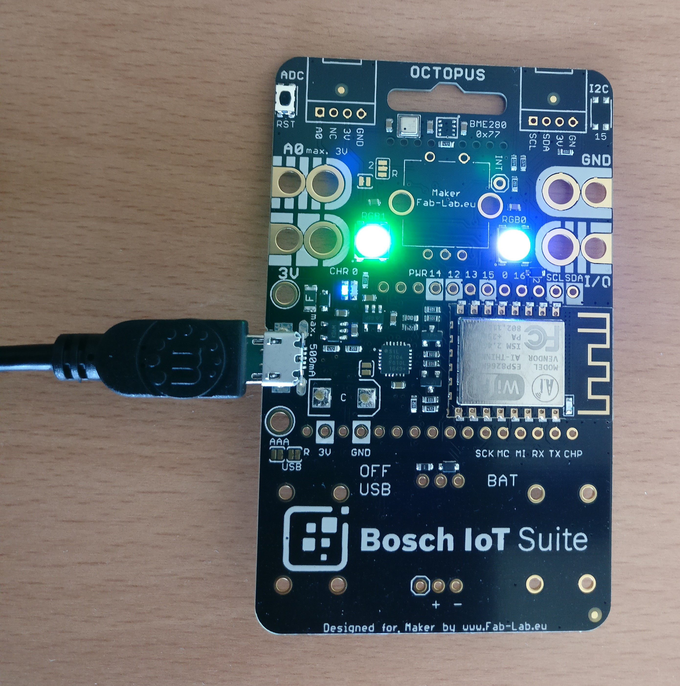

# Using the Octopus board with Eclipse Ditto + Hono

This example shows how to use the Octopus board (Bosch IoT Suite edition) with Eclipse Ditto and Eclipse Hono.

Before you can start, you have to prepare your [setup by setting up the Arduino IDE](#setup-ide).

## About the Octopus board

The Octopus board is created by Guido Burger. Its original purpose was to be used as a teaching tool for Hackathons in
secondary schools in Germany. It features a number of sensors, and the ability to connect sensors, inputs, and 
actuators in a relatively simple way. More information and the source code for the schematics can be found on the 
[Fab-Lab.eu Octopus page](http://fab-lab.eu/octopus/). 

While Guido Burger offers some boards in his Tindie store, overall the Octopus board is a not-for-profit activity.
The Octopus board is a small board based on a ESP8266 Chip that can be programmed e.g. using the Arduino IDE.
The special thing about this board is, that it already contains components that makes it a ready-to-run starter-kit 
to experiment with the Internet of Things.
Here you can see a detailed description of the official Octopus Board used for the "Nationaler IT Gipfel".


Source: [Tindimedia](https://cdn.tindiemedia.com/images/resize/tPhVtjN_DuxDKaRkY0-bOKacDbU=/p/74x59:1024x692/full-fit-in/2400x1600/i/52962/products/2016-12-08T20%3A25%3A54.337Z-octo_pinout_final_top.jpg)


For example, the Bosch IoT Suite edition board contains the following sensors:
* [Bosch Sensortec BNO055](https://www.bosch-sensortec.com/bst/products/all_products/bno055) 
9-axis absolute orientation sensor – provides acceleration, gyroscope, spatial positioning, magnetic field etc.
* [Bosch Sensortec BME680](https://www.bosch-sensortec.com/bst/products/all_products/bme680)
environmental sensor – provides temperature, humidity, air pressure, altitude, air quality



In this example we use both of these sensors as well as the WiFi component and the two LEDs.

## Programming your board

To program your board you can use the [Arduino IDE](https://www.arduino.cc/en/Main/Software).
There you can write the code that should be executed on your board and upload it to your board.

### Setup IDE

1. Download [Arduino IDE](https://www.arduino.cc/en/Main/Software)
2. Configure [ESP8266 board support](https://learn.adafruit.com/adafruit-feather-huzzah-esp8266/using-arduino-ide#install-the-esp8266-board-package)
3. Install the following libraries (Sketch > Include Library > Manage Libraries)
    * [Adafruit Unified Sensor library](https://github.com/adafruit/Adafruit_Sensor)
    * [Adafruit BME680 library](https://github.com/adafruit/Adafruit_BME680)
    * [Adafruit BNO055 library](https://github.com/adafruit/Adafruit_BNO055)
    * [Adafruit NeoPixel library](https://github.com/adafruit/Adafruit_NeoPixel)
    * [PubSubClient library](https://github.com/knolleary/pubsubclient)
    * [ArduinoJson library](https://github.com/bblanchon/ArduinoJson)
4. Edit the file `${ArduinoDirectory}/libraries/pubsubclient/src/PubSubClient.h` and set the MQTT_MAX_PACKET_SIZE
to 2048. This is required because the size of our MQTT messages sent using the PubSubClient library have to fit into
an array of this size. Unfortunately we can't define MQTT_MAX_PACKET_SIZE in our sources because of the way Arduino IDE
compiles.


### Eclipse Ditto sandbox

The Eclipse Ditto sandbox allows you to create a digital twin of a thing, in our example the Octopus board.
This means Ditto will mirror your device and will make for example the values of the sensors of your board
available to any interested party you allow to access the information.

The cool thing hereby is that it doesn't matter if your device is available at the time the other party asks for 
sensor values.<br/>
Ditto will deliver the last known state of your device.


### Eclipse Hono sandbox

The Eclipse Hono sandbox allows to connect devices through various protocols. 
For our example your Octopus will communicate via MQTT.

For this example you need a Eclipse Hono tenant. A description about Honos multi tenancy concepts can be found 
[here](https://blog.bosch-si.com/developer/using-multi-tenancy-in-eclipse-hono/).
  

Have a look at
[Ditto's blog post about connecting Ditto to Hono](https://www.eclipse.dev/ditto/2018-05-02-connecting-ditto-hono.html)
to find out how to create a connection between Ditto and Hono.

## Configure the Arduino Sketch

The Arduino Sketch, we have prepared, publishes the sensor information via the Eclipse Hono to Eclipse Ditto

Open `octopus-hono-ditto/octopus-hono-ditto.ino` in your Arduino IDE.

All properties have to be set in `octopus-hono-ditto/settings.h`
Just create this file from the following template and replace XXX placeholders with your configuration properties.

```
#ifndef SETTINGS_H
#define SETTING_H

// ---- WiFi configuration ----
#define WIFI_SSID "XXX"         // The SSID of the WiFi you want your octopus board to cconnect to
#define WIFI_PASSWORD "XXX"     // The password of the WiFi you want your octopus board to cconnect to

// ---- Ditto registration properties ----
#define DITTO_NAMESPACE "org.eclipse.ditto" // The namespace to use for your Ditto Thing
#define DITTO_THING_ID "XXX"

// ---- Hono registration properties ----
#define HONO_TENANT "org.eclipse.ditto" // The tenant id of your Hono tenant
#define HONO_DEVICE_ID "XXX"        // The Hono device id
#define HONO_DEVICE_AUTH_ID "XXX"   // The Hono auth id
#define HONO_DEVICE_PASSWORD "XXX"  // The Hono device password

// ---- Update rate of sensors ----
#define SENSOR_UPDATE_RATE_MS 5000 // Print updated sensor value every 5 seconds
#define LOOP_DELAY 100

// ---- Hono MQTT configuration ----
#define MQTT_BROKER "hono.eclipse.org"
#define MQTT_PORT 8883
/* SHA-1 fingerprint of the server certificate of the MQTT broker, UPPERCASE and spacing */
/* openssl s_client -connect hono.eclipse.org:8883 < /dev/null 2>/dev/null | openssl x509 -fingerprint -noout -in /dev/stdin */
#define MQTT_SERVER_FINGERPRINT "8E 64 5C A0 4C C8 8B E7 86 F0 32 64 1D 9A 9E A3 F3 6A 4A DF"

#endif
```

## Retrieve stored sensor data from the Ditto sandbox

The data of the registered thing can be retrieved via the 
[HTTP API of Eclipse Ditto](https://ditto.eclipseprojects.io/apidoc/?url=%2Fapidoc%2Fopenapi%2Fditto-api-2.yml#!/Things/get_things_thingId).

For the ease of this example we provide a view of the data at
`html/index.html`. The page fetches the Twin once and later changes are pushed via server-sent events from the Ditto sandbox.

Because of the 'same-origin-policy' you need to provide this html via a webserver.<br/>
For example IntelliJ supports this by right click on the index.html inside IntelliJ and select 'Open in Browser'.

## Make it run!

You're now fully prepared to let your Octopus board publish its sensor information to Eclipse Ditto.

Just press "Upload" inside the Arduino IDE and wait until it's uploaded.<br/>
For troubleshooting, feel free to use the "Serial Monitor" of the Arduino IDE, where you can find the latest log
messages.

You should see updates to your twin in the following format:

```json
{
    "thingId": "org.eclipse.ditto:demo-device",
    "policyId": "org.eclipse.ditto:demo-device",
    "features": {
        "TemperatureSensor_BNO055": {
            "properties": {
                "status": {
                    "sensorValue": 34,
                    "minMeasuredValue": 31,
                    "maxMeasuredValue": 35,
                    "sensorUnits": "°C"
                }
            }
        },
        "LinearAcceleration_BNO055": {
            "properties": {
                "status": {
                    "xValue": -0.04,
                    "yValue": -0.05,
                    "zValue": 0,
                    "sensorUnits": "m/s^2"
                }
            }
        },
        "AngularVelocity_BNO055": {
            "properties": {
                "status": {
                    "xValue": 0.02,
                    "yValue": 0.02,
                    "zValue": 0,
                    "sensorUnits": "rad/s"
                }
            }
        },
        "HumiditySensor_BME680": {
            "properties": {
                "status": {
                    "sensorValue": 31.74,
                    "minMeasuredValue": 29.59,
                    "maxMeasuredValue": 37.01,
                    "sensorUnits": "%"
                }
            }
        },
        "TemperatureSensor_BME680": {
            "properties": {
                "status": {
                    "sensorValue": 32.83,
                    "minMeasuredValue": 29.96,
                    "maxMeasuredValue": 33.93,
                    "sensorUnits": "°C"
                }
            }
        },
        "Gravity_BNO055": {
            "properties": {
                "status": {
                    "xValue": -0.01,
                    "yValue": -0.6,
                    "zValue": -9.78,
                    "sensorUnits": "m/s^2"
                }
            }
        },
        "AbsoluteOrientation_BNO055": {
            "properties": {
                "status": {
                    "xValue": 57.81,
                    "yValue": -0.06,
                    "zValue": 176.44,
                    "sensorUnits": "°"
                }
            }
        },
        "Barometer_BME680": {
            "properties": {
                "status": {
                    "sensorValue": 972.1,
                    "minMeasuredValue": 972.03,
                    "maxMeasuredValue": 972.22,
                    "sensorUnits": "hPa"
                }
            }
        },
        "Power_0": {
            "properties": {
                "status": {
                    "sensorValue": 2.99,
                    "minMeasuredValue": 2.98,
                    "maxMeasuredValue": 3.02,
                    "sensorUnits": "V"
                }
            }
        },
        "Accelerometer_BNO055": {
            "properties": {
                "status": {
                    "xValue": -0.05,
                    "yValue": -0.66,
                    "zValue": -9.79,
                    "sensorUnits": "m/s^2"
                }
            }
        },
        "Magnetometer_BNO055": {
            "properties": {
                "status": {
                    "xValue": 10.56,
                    "yValue": 8.5,
                    "zValue": 51.5,
                    "sensorUnits": "uT"
                }
            }
        }
    }
}
```
