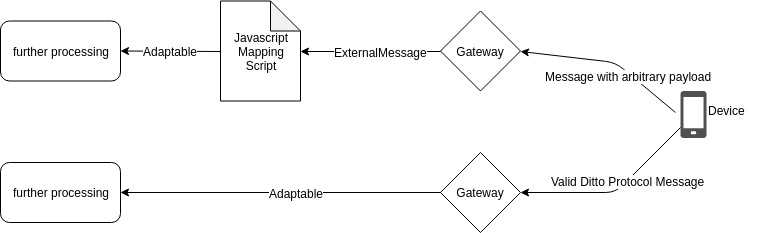

# How to test Javascript Mapping functions for Eclipse Ditto

## Summary

In `org.eclipse.ditto.mappingfunction.testcase.MappingFunctionTestCase` you can find an entry point for a builder that helps to test your javascript mapping function using the javascript mapping feature of Eclipse Ditto.

 ## Basic concept


As you can see, incoming messages from a device will be received by the gateway and afterwards handled as an `ExternalMessage`.
The `ExternalMessage` Object wraps the payload of the message either in `bytePayload` or in `textPayload`.
Depending on the content-type, your mapping can decide whether to map or to drop the message.
 
Without applying any payload mapping, the incoming message is expected to be a valid [Ditto Protocol message](https://www.eclipse.org/ditto/protocol-specification.html).
If the message you're trying to process with a connection is for some reason not a valid Ditto Protocol message, you 
can use payload mapping to transform the message into one.


  
Vice versa you can apply the same logic on outgoing payload mapping comparison. An outgoing message is always a Ditto Protocol message and can be converted into the format required by the consumer of this message in the outgoing payload mapping.
   

## Getting started

 This tutorial will show an example usage of `org.eclipse.ditto.mappingfunction.testcase.MappingFunctionTestCase` to test the [Text payload example from the official Eclipse Ditto Documentation](https://www.eclipse.org/ditto/connectivity-mapping.html#text-payload-example).

 ### Think about the expected outcome
 
 Before applying a javascript mapping to your connection, you have to think about how the message would have to look 
 like without any mapping. 
 
 Let's assume you have device with a digital twin which looks like this:
 ```json
{
  "thingId": "the.namespace:the-thing-id",
  "policyId": "the.namespace:the-policy-id",
  "features": {
    "temperature": {
       "properties": {
         "value": 23.42
       }
     },
    "pressure": {
       "properties": {
         "value": 760
       }
     },
    "humidity": {
       "properties": {
         "value": 78
       }
     }
  }
}
```
 
 Furthermore your device sends telemetry data via 
 [Eclipse Hono's](https://www.eclipse.org/hono/) MQTT adapter into the cloud. 
 
 The example payload is looking like this:
 ```json
{
    "temp": "23.42 °C",
    "hum": 78,
    "pres": {
        "value": 760,
        "unit": "mmHg"
    }
}
```
This message is provided as file at `src/test/resources/TextPayloadMapping/incoming.json`.

In order to consume this message using Ditto, a payload mapping is required to convert the message into a valid Ditto Protocol message.
In this case, the device sends the telemetry data with the intention of updating it's digital twin with the new data.
Let's depict this intention of updating the digital twin into a Ditto Protocol Message - first of all, it's a command and as stated in the [Eclipse Ditto Documentation](https://www.eclipse.org/ditto/protocol-examples.html), a command message looks like this:

```json
{
  "topic": "the.namespace/the-thing-id/things/twin/commands/modify",
  "headers": {
    "correlation-id": "a780b7b5-fdd2-4864-91fc-80df6bb0a636"
  },
  ...
}
```

The topic path contains the `namespace` and the  `thing name` separated by  a `/`.

The payload of the message consumed by Ditto only contains feature values in this case.
This means, you can set the path of the command message to `/features`, because the command should only update the features of the thing.

```json
{
  "topic": "the.namespace/the-thing-id/things/twin/commands/modify",
  "headers": {
    "correlation-id": "a780b7b5-fdd2-4864-91fc-80df6bb0a636"
  },
  "path": "/features",
  ...
}
```

Now there's just the value you want to adjust missing - in this case it's `temperature`, `humidity` and `pressure`.
The property values should be the same as in the example payload coming from the device.

Putting it all together:

```json
{
  "topic": "the.namespace/the-thing-id/things/twin/commands/modify",
  "headers": {},
  "path": "/features",
  "value": {
    "temperature": {
      "properties": {
        "value": 23.42
      }
    },
    "pressure": {
      "properties": {
        "value": 760
      }
    },
    "humidity": {
      "properties": {
        "value": 78
      }
    }
  }
}
```
This is how the valid Ditto Protocol Message would look like - let's call it the *expectedAdaptable*.
We provide this json as file at `src/test/resources/TextPayloadMapping/expectedAdaptable.json`.

### Define a JavaScript mapping function

Hence you have to define a payload mapping for your connection which transforms the very small telemetry payload into a message that looks like the *expectedAdaptable*.

The following `incoming` mapping function does this:

```javascript
function mapToDittoProtocolMsg(
    headers,
    textPayload,
    bytePayload,
    contentType
) {
    
    if (contentType !== 'application/json') {
        return null; // only handle messages with content-type application/json
    }
    
    let jsonData = JSON.parse(textPayload);
    
    let value = {
        temperature: {
            properties: {
                value: jsonData.temp.split(" ")[0] // omit the unit
            }
        },
        pressure: {
            properties: {
                value: jsonData.pres.value
            }
        },
        humidity: {
            properties: {
                value: jsonData.hum
            }
        }
    };

    return Ditto.buildDittoProtocolMsg(
        'the.namespace', // in this example always the same
        headers['device_id'], // Eclipse Hono sets the authenticated device_id as AMQP 1.0 header
        'things', // we deal with a Thing
        'twin', // we want to update the twin
        'commands', // we want to create a command to update a twin
        'modify', // modify the twin
        '/features', // modify all features at once
        headers, // pass through the headers from AMQP 1.0
        value
    );
}
```

This mapping function is provided as file at `src/test/resources/TextPayloadMapping/incoming.js`.

### Write a test for the mapping function

```java
@Test
public void incomingTextPayloadMapping() throws IOException {
    // Instantiate the mapping function under test
    final Resource incomingMappingFunction = new Resource("TextPayloadMapping/incoming.js");
    final MappingFunction underTest = MappingFunction.fromJavaScript(incomingMappingFunction.getContent());

    final DittoHeaders dittoHeaders = Utils.createHeaders(ContentTypes.APPLICATION_JSON.toString());

    // Instantiate the incoming message
    final Resource incomingMessageJson = new Resource("TextPayloadMapping/incoming.json");
    final ExternalMessage incomingMessage = ExternalMessageFactory.newExternalMessageBuilder(dittoHeaders)
            .withText(incomingMessageJson.getContent())
            .build();

    // Instantiate the expected adaptable
    final Resource expectedAdaptableJsonResource = new Resource("TextPayloadMapping/expectedAdaptable.json");
    final JsonObject expectedAdaptableJson = JsonFactory.newObject(expectedAdaptableJsonResource.getContent());
    final Adaptable expectedAdaptable = ProtocolFactory
            .jsonifiableAdaptableFromJson(expectedAdaptableJson)
            .setDittoHeaders(dittoHeaders);

    // Define and run the test case
    MappingFunctionTestCase.forIncomingMappingFunction(underTest)
            .withExpectedMappingResult(expectedAdaptable)
            .whenMapping(incomingMessage)
            .run();
}
```

The code above makes use of the `org.eclipse.ditto.mappingfunction.testcase.Resource` class to load content from a file within the classpath.
Feel free to choose whether you want to provide the test data directly as String inside your test, or via a file like shown in the test above.

For more examples for the usage of `org.eclipse.ditto.mappingfunction.testcase.MappingFunctionTestCase` have a look at the test classes in `src/test/java/org.eclipse.ditto.examples.mappingfunction.testcase`.
