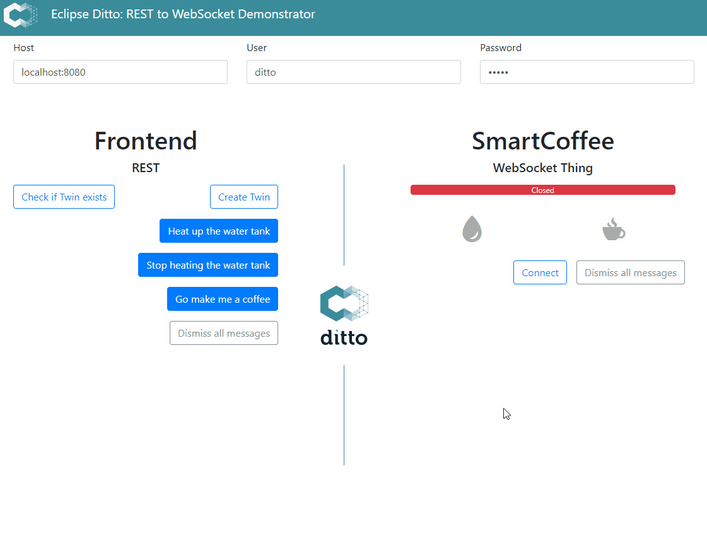
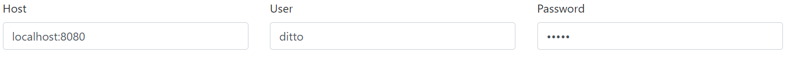
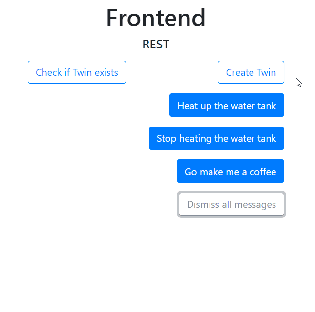
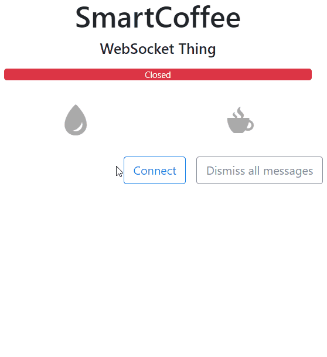
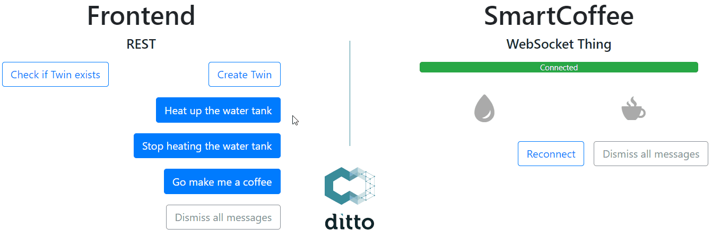
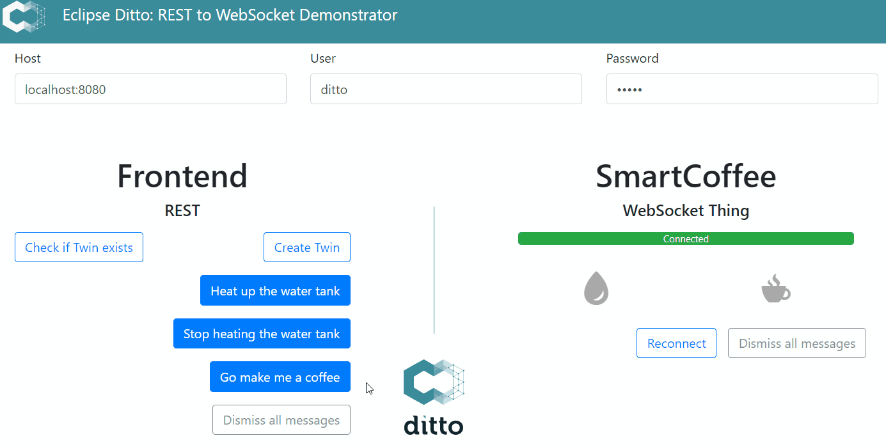

This example shows how to leverage the powers of combining the REST and
WebSocket Messages API of [Eclipse Ditto](https://eclipse.dev/ditto/).
It demonstrates how to send direct Messages to a *live* Thing, as well as
updating the *twin* representation of a Thing inside Ditto.

> Eclipse Ditto uses the concept of *Digital Twins* which are essentially
a digital representation of a real world (*"live"*) device. To learn
more about this concept, head over to the Eclipse Ditto project page.



The Thing in this case is a smart coffee machine (SmartCoffee) that has
some basic functionality. It accepts Messages that allow to start or stop
the heating of the water tank. Moreover you can request the coffee
machine to brew coffee, so you don't have to wait for your dose of caffeine :wink:.<br/>
But before starting to brew a coffee, SmartCoffee will send a captcha
that has to be solved.

The example application is split into two sides of a possible IoT project:
The management UI and the Thing.<br/>
The UI in this case uses the REST API of Ditto to communicate with Ditto and to *directly* (using **Ditto as a broker**) 
send Messages to the Thing.<br/>
The Thing itself has a WebSocket connection to Ditto, which enables it
to use the functionality of the [Ditto Protocol](https://eclipse.dev/ditto/protocol-overview.html).

For demonstration purposes, frontend and Thing are using the same UI and are simply
split into two JavaScript files. In a real device example, you would have
them separated in soft- and hardware. Hence, this example does not attempt to
reflect the real world, but tries to showcase multiple functions of Ditto,
that could as well be transferred to real devices:
* at the management UI:
    * creating a Digital Twin using Ditto REST API with basic authentication
    * sending a Message directly to a Thing using the Ditto REST API
* at the device:
    * receiving, sending and replying to Messages using the Ditto WebSocket API
    * updating the Twin representation of the Thing using the Ditto WebSocket API
    * using different content types for Ditto's Messages API

# Setup

All we need for this example is a running Eclipse Ditto instance.
Please follow the guidelines at the [Eclipse Ditto](https://eclipse.dev/ditto/installation-running.html)
project to get started.

Additionally, you should create the policy `org.eclipse.ditto:smartcoffee` (if it does not exist), example of creating a policy:
```sh
curl --request PUT \
  --url http://localhost:8080/api/2/policies/org.eclipse.ditto:smartcoffee \
  --header 'Content-Type: application/json' \
  --header 'Authorization: Basic ZGl0dG86ZGl0dG8=' \
  --data '{
    "entries": {
        "owner": {
            "subjects": {
                "nginx:ditto": {
                    "type": "admin aissam"
                }
            },
            "resources": {
                "thing:/": {
                    "grant": ["READ", "WRITE"],
                    "revoke": []
                },
                "policy:/": {
                    "grant": ["READ", "WRITE"],
                    "revoke": []
                },
                "message:/": {
                    "grant": ["READ", "WRITE"],
                    "revoke": []
                }
            }
        }
    }
}'
```

To use the UI, you can simply open `index.html` in your favorite (hopefully
 state-of-the-art :wink:) browser.

# Playing around with the UI

The first step after opening the UI should be setting the connection settings.
By default they should be correct when running Ditto locally.



Now you can create the Digital Twin of SmartCoffee by clicking `Create Twin`.
Without it, Ditto won't be able to route Messages to SmartCoffee. Below
the buttons, you should see the REST request that were sent by the frontend
as well as the responses by Ditto.

<br/>



<br/>

You can check if creating the Twin worked by looking at the requests, or
by clicking `Check if Twin exists`. This will send a `GET` request
to Ditto asking for the Thing.

To be able to send Messages to the Thing, it should be online. Otherwise
Ditto can't route the Messages to it. Therefore, connect SmartCoffee by
using the `Connect` button. Shortly after its status bar should get green.

Notice that SmartCoffee instantly sends `START-SEND-MESSAGES` to Ditto.
This is required if you want to receive Ditto Protocol Messages over the
WebSocket API. The response `START-SEND-MESSAGES:ACK` acknowledges that
it now starts receiving Messages.

<br/>



<br/>

>Ditto offers no Message retention. If a device isn't connected when a Message
should be routed, it will never receive the Message. To be able to send and
receive Messages for a Thing, you need to have the correct permissions on it.
Check the Eclipse Ditto docs for in-depth knowledge.

Now Ditto should be able to route Messages sent from the frontend via REST
over to the Thing that is connected via WebSocket. It will also route
the response of the Thing back to the REST frontend.

Using `Heat up the water tank` and `Stop heating the water tank`, the frontend
advises SmartCoffee to change the state of its water tank. SmartCoffee
will update its UI on receiving the Messages. Both sides will exchange
JSON content.

<br/>



<br/>

SmartCoffee can not only heat up water, but also brew coffee. To request that, 
use the `Go make me a coffee` button. The frontend will send a request
to brew a coffee, and SmartCoffee will reply with an image. This differs
from the former Messages, since a different content type is used (`image/png`).
After solving the captcha on the frontend side, it will send a new request
to SmartCoffee with the solved content, which will eventually trigger
a coffee to be brewed.

<br/>



<br/>

When looking at the messages that SmartCoffee will send over the WebSocket,
you will see that it will also send a message that will change a feature
property of its Digital Twin (hint: it is the message to topic
`org.eclipse.ditto/smartcoffee/things/twin/commands/modify`).

To learn all about the concepts used in this example and how to go even
further using Eclipse Ditto, head over to its [documentation](https://eclipse.dev/ditto/)
or dive directly into the code on [github](https://github.com/eclipse/ditto).
