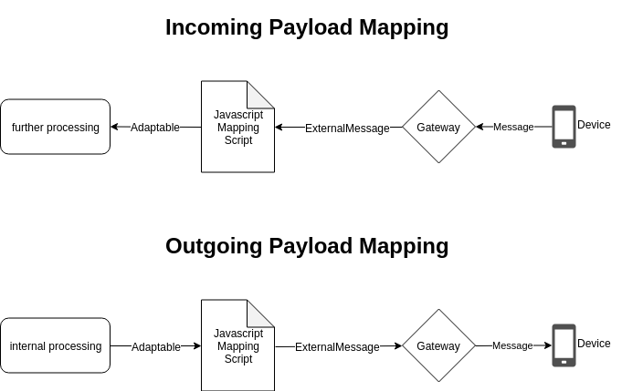

# ScriptRunner examples

## Summary

This example is about how to test javascript mapping scripts. Due to the fact, that Bosch IoT Things does not support
 on side debugging of your scripts so far, this is the proper way to check if the mapping script is valid. The 
 example makes use of the `ScriptRunner` class which wraps the mapping functionality into a class and makes it easy 
 to use. With this class it is possible to write unit tests for your scripts.
 
 ## Basic concept
 
 
 As you can see, messages from a device will be received by the gateway and afterwards handled as an ExternalMessage.
  The `ExternalMessage` Object wraps the payload of the message either in `bytePayload` or in `textPayload`. 
  Depending on the content-type, your mapping can decide whether to map or to drop the message.
  
  If you don't apply any javascript mapping to your connection, the messages have to be valid Ditto Protocol messages
  . Hence you can assume, that your message, which you have to apply payload mapping on, has to be exact the same 
  `Adaptable` after mapping as a valid Ditto Protocol Message with the same intention. Therefore you need to think 
  about how the valid Ditto Protocol Message looks like, then you can compare your mapped `Adaptable` with the 
  `Adaptable` generated out of a Ditto Protocol Message.
  
  
  
  Vice versa you can apply the same logic on outgoing payload mapping comparison - but instead of using the `Adaptable`
   for comparison, you can use the `ExternalMessage`. The `ExternalMessage` contains either the `byte` or 
   `textPayload` which you expect to be received by your device or any other consumer.
   
 ## Getting started
 
 This tutorial will show how to test the mapping with the payload mapping examples from the
   [official Eclipse Ditto Documentation](https://www.eclipse.org/ditto/connectivity-mapping.html).
 
 ### Incoming Payload Mapping
 
 Before applying a javascript mapping to your connection, you have to think about how the message would have to look 
 like without any mapping. 
 
 Let's assume you have device with a digital twin which looks like this:
 ```json
{
  "thingId": "the.namespace:the-thing-id",
  "policyId": "the.namespace:the-policy-id",
  "features": {
    "temperature": {
       "properties": {
         "value": 23.42
       }
     },
    "pressure": {
       "properties": {
         "value": 760
       }
     },
    "humidity": {
       "properties": {
         "value": 78
       }
     }
  }
}
```
 
 Furthermore your device sends telemetry data via 
 [Eclipse Hono's](https://www.eclipse.org/hono/) MQTT adapter into the cloud. 
 
 The example payload is looking like this:
 ```json
{
    "temp": "23.42 °C",
    "hum": 78,
    "pres": {
        "value": 760,
        "unit": "mmHg"
    }
}
```
Ditto can't do anything with this payload - a valid Ditto Protocol Message needs a bit more information. In this 
case, the device sends the telemetry data with the intention of updating it's digital twin with the new data. Let's 
depict this intention of updating the digital twin into a Ditto Protocol Message - first of all, it's a command and 
as stated in the [Eclipse Ditto Documentation](https://www.eclipse.org/ditto/protocol-examples.html), a command 
message looks like this:

```json
{
  "topic": "com.acme/xdk_58/things/twin/commands/modify",
  "headers": {
    "correlation-id": "a780b7b5-fdd2-4864-91fc-80df6bb0a636"
  },
  "path": "/"
  ...
}
```

The topic path contains the `namespace` and the `thingId` - in this case *com.acme* as the namespace and *xdk_58* as 
the thingId. As stated above, your device has another namespace and thingId, so let's change it to 
`namespace: the.namespace` & `thingId: the-thing-id`.

The payload, Ditto get's from the device (see above), only contains feature values. This means, you can adjust the 
path of the command message to `/features`. Now there's just the value you want to adjust missing - in this case it's
`temperature`, `humidity` and `pressure`. The property values should be the same as in the example payload coming 
from the device.

Putting it all together:

```json
{
  "topic": "the.namespace/the-thing-id/things/twin/commands/modify",
  "headers": {},
  "path": "/features",
  "value": {
    "temperature": {
      "properties": {
        "value": 23.42
      }
    },
    "pressure": {
      "properties": {
        "value": 760
      }
    },
    "humidity": {
      "properties": {
        "value": 78
      }
    }
  }
}
```
This is how the valid Ditto Protocol Message would be look like - let's call it the *expectedMessage*.

Hence you have to apply payload mapping to your connection which transforms the very small telemetry payload into a 
message that looks like the *expectedMessage*.

The following `incoming` mapping function does this:

```javascript
function mapToDittoProtocolMsg(
    headers,
    textPayload,
    bytePayload,
    contentType
) {
    
    if (contentType !== 'application/json') {
        return null; // only handle messages with content-type application/json
    }
    
    let jsonData = JSON.parse(textPayload);
    
    let value = {
        temperature: {
            properties: {
                value: jsonData.temp.split(" ")[0] // omit the unit
            }
        },
        pressure: {
            properties: {
                value: jsonData.pres.value
            }
        },
        humidity: {
            properties: {
                value: jsonData.hum
            }
        }
    };

    return Ditto.buildDittoProtocolMsg(
        'the.namespace', // in this example always the same
        headers['device_id'], // Eclipse Hono sets the authenticated device_id as AMQP 1.0 header
        'things', // we deal with a Thing
        'twin', // we want to update the twin
        'commands', // we want to create a command to update a twin
        'modify', // modify the twin
        '/features', // modify all features at once
        headers, // pass through the headers from AMQP 1.0
        value
    );
}
```

You should now have a JSON file with the digital twin, a JSON file for the *expectedMessage* and a JS file for the 
mapping. With this you can now validate, that your mapping works as expected.

> See `src/main/java/org.eclipse.ditto.examples.scriptrunner.examples/ScriptRunnerExamples` as reference

It is suggested to write unit test for your mapping. So let's start with a simple test:

```java
@Test
public void testIncomingPayloadMapping() {
    
}
```
ScriptRunner provides the static function `readFromFile` which let you load the script easy from anywhere in your 
directory structure - and you don't have to handle a long `String` in your code.
```java
final String EXPECTED_MESSAGE = ScriptRunner.readFromFile(<Path to your JSON file>);
final String ACTUAL_MESSAGE = ScriptRunner.readFromFile(<Path to you actual payload JSON file>);
final String MAPPING_FUNCTION = ScriptRunner.readFromFile(<Path to your JS file>);
```
Now instantiate a `ScriptRunner` with the content-type "*application/json*" as the payload you expect is JSON.
```java
ScriptRunner runner = new ScriptRunner.ScriptRunnerBuilder().withContentType("application/json")
                        .withIncomingScriptOnly(MAPPING_FUNCTION)
                        .build();
```
As considered [above](#basic-concept), the messages will be wrapped into an `ExternalMessage`, that means you have to
 create an `ExternalMessage` and put the payload either into `bytePayload` or into `textPayload`, depending on what 
 kind of payload you expect. In this case it is obviously `textPayload`. Last but not least, there are just the Headers
  missing. As stated above, in a real world scenario, this message would come from 
  [Eclipse Hono's](https://www.eclipse.org/hono/) MQTT adapter - that supplies at least the *device-id* and the 
  content-type:
  ```java
final Map<String, String> headers = new HashMap<>();
headers.put("content-type", "application/json");
headers.put("device_id", "the-thing-id");
DittoHeaders dittoHeaders = DittoHeaders.of(headers);
  
ExternalMessage message = ExternalMessageFactory.newExternalMessageBuilder(dittoHeaders)
                            .withText(ACTUAL_MESSAGE)
                            .build();
```
Now you can apply the javascript mapping to the `ExternalMessage message`:
```java
Adaptable externalMessage = runner.mapExternalMessage(message); // magic ;-)
```
Now you can compare that mapped message with the expected message - but before you can do this, you have to transfrom
 that message to an `Adaptable` as well!
 ```java
Adaptable expectedMessage = runner.adaptableFromJson(EXPECTED_MESSAGE, dittoHeaders);
```
Let's check if everything has worked out:
```java
assertThat(externalMessage).isEqualTo(expectedMessage);
```
Done! You can see the full working example 
[here](./src/main/java/org/eclipse/ditto/examples/scriptrunner_examples/ScriptRunnerExamples.java).

### Outgoing Payload Mapping


